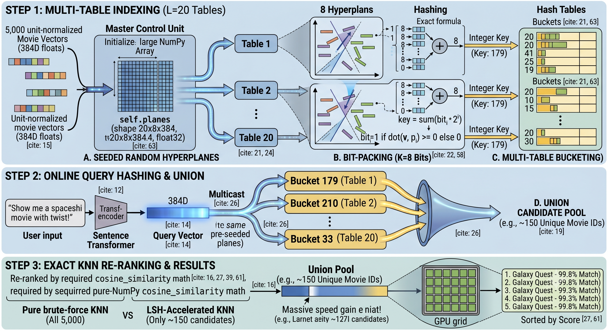

# CineMatch — Semantic Movie Search

**[Live demo → leonshumil.github.io/locality-sensitive-hashing](https://leonshumil.github.io/locality-sensitive-hashing/)**

Find movies by meaning, not keywords. Neural sentence embeddings + Locality-Sensitive Hashing over 4,803 TMDB films.



## How it works

1. **Embed** — The query is encoded into a 384-dim vector by `all-MiniLM-L6-v2` (sentence-transformers).
2. **Hash** — The vector is projected through 20 sets of 8 random hyperplanes; similar vectors collide into the same LSH bucket.
3. **Retrieve** — Only movies in matching buckets become candidates (~1% of the index), skipping exhaustive search.
4. **Rank** — Candidates are re-scored by exact cosine similarity and the top-K are returned.

## Repository layout

| File | Description |
|---|---|
| `search.py` | Core library: `cosine_similarity`, `LSHIndex`, `search()` |
| `server.py` | Flask API wrapping `search.py` (run locally for live search) |
| `index.html` | GitHub Pages frontend |
| `style.css` | Dark-theme stylesheet |
| `app.js` | Frontend logic — calls local API, falls back to demo results |
| `demo_results.json` | Precomputed results for 6 demo queries, 20 results each (static fallback) |
| `config.example.js` | API key template — copy to `config.js` and fill in your key |
| `config.js` | Your TMDB API key — **not committed** (listed in `.gitignore`) |
| `settings.json` | LSH hyperparameters, file paths, top-k default |
| `tmdb_data.json` | Movie metadata (4,803 films) |
| `tmdb_vectors.npy` | Precomputed normalized embeddings |
| `test_local.py` | Local correctness checker |
| `requirements.txt` | Python dependencies |

## Quick start

### Run the frontend (static demo, no server needed)

Open `index.html` directly in a browser, or serve it with any static server:

```bash
python -m http.server 8080
# then open http://localhost:8080
```

Click any demo pill or type a query. Results come from `demo_results.json` when the local API is not running.

### Run the live API

```bash
pip install flask flask-cors          # server extras (beyond requirements.txt)
python server.py                      # starts on http://localhost:5000
```

Then refresh the page — the badge switches from **Demo** to **Live API** and any query is answered in real time.

### Enable movie posters

The API key is loaded from `config.js`, which is **not committed** (it's in `.gitignore`).

```bash
cp config.example.js config.js
# then open config.js and paste your key:
#   const TMDB_API_KEY = 'your_key_here';
```

Get a free key at [themoviedb.org/settings/api](https://www.themoviedb.org/settings/api).

### Run backend tests

```bash
pip install -r requirements.txt
python test_local.py
```

## Configuration

`settings.json` controls LSH behaviour:

```json
{
  "lsh": {
    "num_tables":      20,
    "num_bits":         8,
    "hyperplane_seed": 42
  },
  "search": { "top_k": 5 }
}
```

Increasing `num_tables` improves recall; increasing `num_bits` reduces bucket collisions (sharper candidates).
